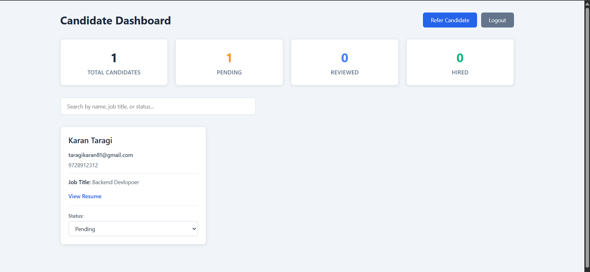

<h1 align="center">👥 Candidate Referral Management System</h1>

<p align="center">
A full-stack web application to manage employee referrals by allowing users to
refer candidates, track application status, and monitor hiring metrics through
a clean and simple dashboard.
</p>

<p align="center">
  
</p>

---

## 📌 Project Overview

The **Candidate Referral Management System** is a full-stack application inspired
by real-world hiring platforms like Worko. It enables authenticated users to
refer candidates for job openings, track their hiring status, and view recruitment metrics.

The project demonstrates **end-to-end full-stack development**, including
authentication, REST APIs, database integration, and a responsive React UI.

---

## 🚀 Key Features

- 🔐 JWT-based authentication (Signup & Login)
- 👤 Refer candidates with job details
- 📄 Resume upload (PDF only – local storage)
- 📋 Dashboard with candidate listing
- 🔍 Search & filter by job title or status
- 🔄 Update status (Pending → Reviewed → Hired)
- 📊 Recruitment metrics dashboard
- 🌐 RESTful APIs (Node.js + Express)
- 🗄️ MongoDB database integration
- ⚡ Axios for API communication

---

## ⚒️ Tech Stack

### Frontend
- React.js (Vite)
- JavaScript (ES6+)
- React Router DOM
- Axios
- CSS

### Backend
- Node.js
- Express.js
- MongoDB (Mongoose)
- JWT Authentication
- Multer

---

## 🧪 Environment Setup

### 📂 Backend (`/backend/.env`)

Create a `.env` file inside the backend folder:

```env
PORT=5000
MONGO_URI=your_mongodb_connection_string
JWT_SECRET=your_secret_key
```

---

## 🔧 Run the Backend

```bash
cd backend
npm install
npm run dev
```

---

### 📂 Frontend (`/frontend/.env`)

Create a `.env` file inside the frontend folder:

```env
VITE_API_URL=https://refreal-system.onrender.com/api
```

---

## 🔧 Run the Frontend

```bash
cd frontend
npm install
npm run dev
```


---

## 🔑 Demo Login Credentials

```
Email: bishtsarthak80@gmail.com
Password: Sarthak@#123
```

---


---
